# Tractian App

Practical test for TRACTIAN

### ✔️ Project
- Project developed with Flutter version 3.24.1
- State management - [GetX](https://pub.dev/packages/get)
- Client HTTP - [Dio](https://pub.dev/packages/dio)
- Local Storage - [SharedPreferences](https://pub.dev/packages/shared_preferences)
- Images - [FlutterSVG](https://pub.dev/packages/flutter_svg)
---
 

### ✔️ Architecture
- Project Clean Code
- Clean architecture layered design
- **Domain Layer**
  - Defining entities, use cases, repositories and enums;
- **Data Layer**
  - Implementation of the domain layer; definition of data sources and http client;
- **Infra Layer**
  - Implementation of data sources and http client defined in the data layer;
- **Presentation Layer**
  - Implementation of application screens and widgets;
- **Design System**
  - Implementation of the design system components used in the application: icons, buttons, colors, input and text styles.
- Translations to allow multiple languages
  - Added support for pt-BR language;
---
 

### ✔️ Flutter Tests
- Unit tests and widgets implemented in the folder **/test**

- Results:

 
  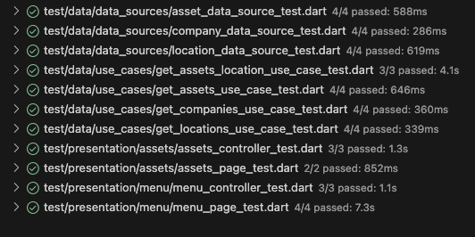 

- Integration tests implemented in the folder **/integration_test**
- Results:

 
  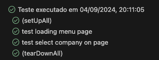 
  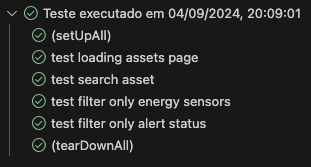 

- Code coverage at **70%** as measured by Flutter Coverage

 
  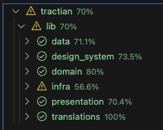

### 📡 API
- Rest API used to query application data
- Base Url: https://fake-api.tractian.com
- Endpoint for company search: GET https://fake-api.tractian.com/companies
- Endpoint for querying a company's location collection: GET https://fake-api.tractian.com/companies/{companyId}/locations
- Endpoint for querying a company's collection of assets and components: GET https://fake-api.tractian.com/companies/{companyId}/assets
>
- Collections mapped by Insomnia and added to the folder **/api**
---
 

### ✔️ Performance
- Concurrent programming using dart **isolates** to create independent threads and be able to manipulate large volumes of data without losing application performance.
- API Cache application using SharedPreferences to allow **Offline First**, when the user does not have an internet connection.

---
 

### 🗺️ Application Screens
Below are some images of the App

 
   
  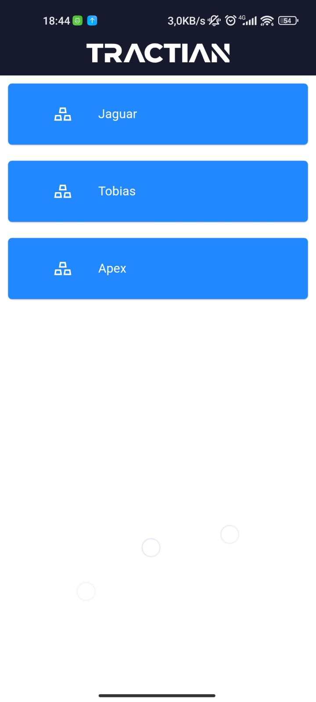 

 
  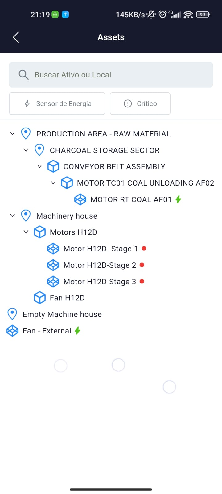 
  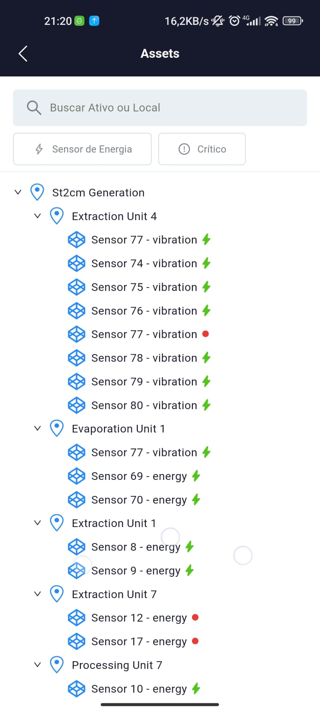 
  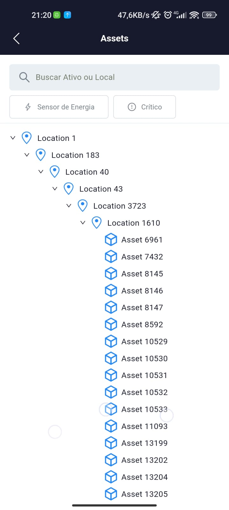 

 
  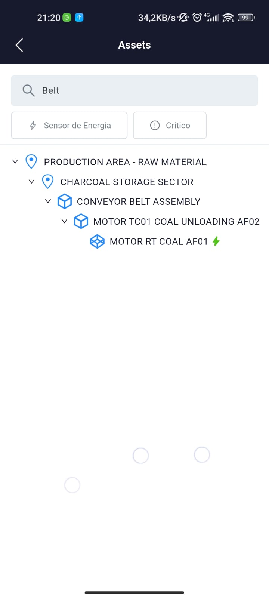 
  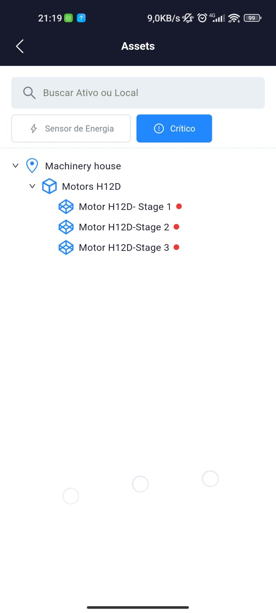 
  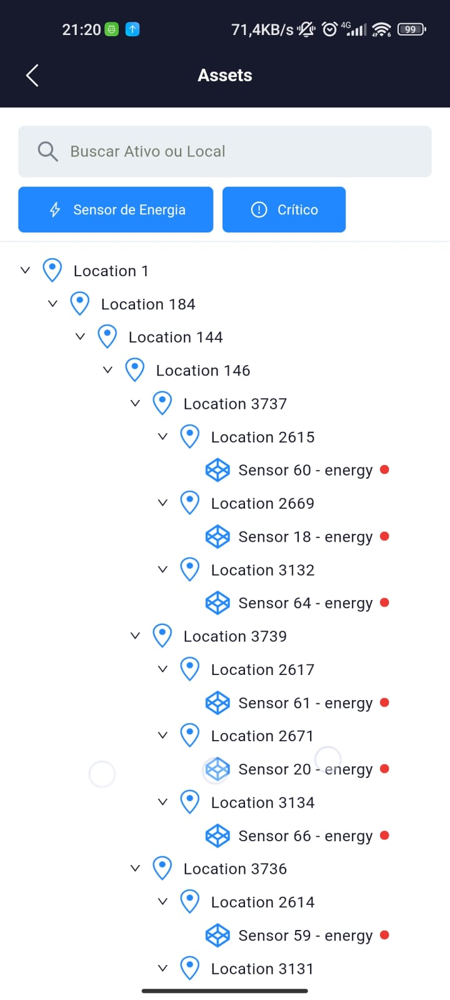 

---
 

### 🔥 How to Run Tractian App
- The App is available at the root of the project and can be downloaded by clicking on the link: [tractian-app-release.apk](https://github.com/cassiomeira12/tractian/blob/master/tractian-app-release.apk)
- The App can be run by running Flutter commands
  - **flutter pub get**
  - **flutter run**
---
 

<footer>
  
 Copyright © Cássio Meira Silva 

